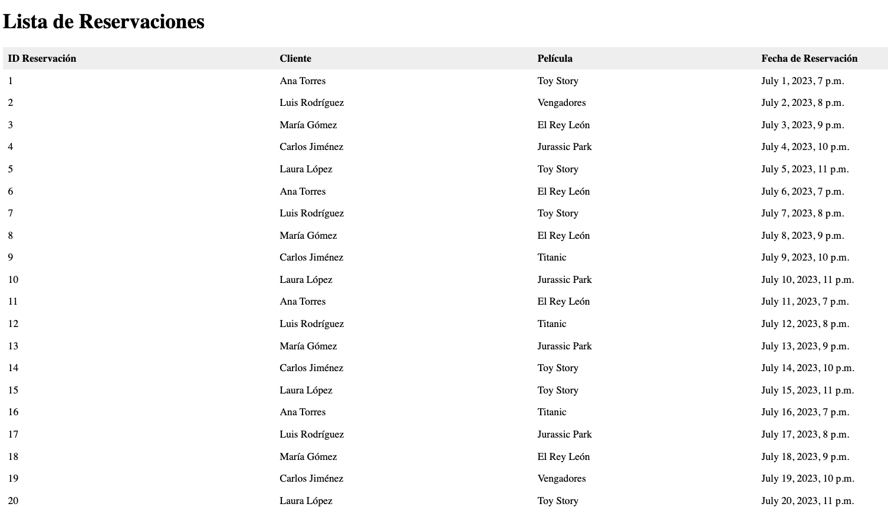

## Guía paso a paso para crear un proyecto Django y conectar con la base de datos PostgreSQL (cine_project)

**Pre requisitos:**

* Asegurate de seguir la guia para crear la base de datos en postgres [guia creacion](configDB.md)

* Tener PostgreSQL instalado y configurado con una base de datos creada (siguiendo los pasos anteriores).
* Tener Django instalado en tu entorno de desarrollo.
* Tener DBeaver instalado para interactuar con la base de datos PostgreSQL (opcional, pero recomendado).


> [NOTA]
> No olvides crear previamente tu entorno virtual


**Pasos:**

**1. Crear un proyecto Django:**

1. Abre una terminal o ventana de comandos.
2. Navega hasta el directorio donde deseas crear tu proyecto Django.
3. Ejecuta el siguiente comando:

```bash
django-admin startproject cine_project
```

**2. Configurar la base de datos en Django:**

> [NOTA]
> Recuerda instalar el adaptador de bases de datos de python [psycopg](https://pypi.org/project/psycopg2/)

1. Abre el archivo `settings.py` de tu proyecto Django (cine_project) en un editor de texto.
2. Busca la sección `DATABASES`.
3. Edita la configuración para que coincida con la información de tu base de datos PostgreSQL. Deberás especificar el nombre de la base de datos, el usuario, la contraseña, el host y el puerto.

```python
DATABASES = {
    'default': {
        'ENGINE': 'django.db.backends.postgresql',
        'NAME': 'tu_base_de_datos',
        'USER': 'tu_usuario',
        'PASSWORD': 'tu_contraseña',
        'HOST': 'localhost',
        'PORT': '5432',
    }
}
```

4. Guarda el archivo `settings.py`.

**3. Crear modelos de Django:**

> [NOTA]
> No olvides crear la aplicacion `cine` con `python manage.py startapp cine`

1. En la terminal, navega hasta el directorio de tu proyecto Django (cine_project).
2. Ejecuta el siguiente comando para crear los modelos a partir de las tablas existentes en PostgreSQL:

```bash
python manage.py inspectdb > cine/models.py
```

3. Este comando generará archivos de modelo de Python en la aplicación `cine` (la que creaste) dentro de la carpeta `models.py`.
4. Abre el archivo `models.py` y revisa los modelos generados. Puedes modificarlos según tus necesidades.

**4. Importar modelos en Django:**

1. En el archivo `settings.py`, agrega la aplicación `cine` a la sección `INSTALLED_APPS`.

```python
INSTALLED_APPS = [
    # ... otras aplicaciones ...
    'cine',
]
```

2. Guarda el archivo `settings.py`.
3. No olvides realizar las migraciones y aplicarlas

**5. Crear vistas en Django:**

1. Crea un archivo `views.py` en la aplicación `cine`.
2. En el archivo `views.py`, importa los modelos y define las funciones de vista que deseas usar para mostrar los datos.

```python
from django.shortcuts import render
from cine.models import Clientes, Peliculas, Reservaciones

def mostrar_clientes(request):
    clientes = Clientes.objects.all()
    return render(request, 'clientes.html', {'clientes': clientes})

def mostrar_peliculas(request):
    peliculas = Peliculas.objects.all()
    return render(request, 'peliculas.html', {'peliculas': peliculas})

def mostrar_reservaciones(request):
    # Obtener todas las reservaciones
    reservaciones = Reservaciones.objects.all()

    # Para cada reservación, obtener los detalles del cliente y la película asociados
    for reservacion in reservaciones:
        reservacion.cliente = Clientes.objects.get(pk=reservacion.id_cliente)
        reservacion.pelicula = Peliculas.objects.get(pk=reservacion.id_pelicula)

    # Renderizar el template con los datos de las reservaciones
    return render(request, 'cine/reservaciones.html', {'reservaciones': reservaciones})

# ... otras funciones de vista ...
```

**6. Crear plantillas HTML:**

1. Crea plantillas HTML para mostrar los datos en tus vistas. Puedes usar el motor de plantillas Django para renderizar los datos dinámicamente.

**cine/templates/cine/clientes.html:**

```html
<h1>Clientes</h1>
<ul>
    
        <li>{{ cliente.nombre }}</li>
    
</ul>
```

**cine/templates/cine/peliculas.html:**

```html
<h1>Películas</h1>
<ul>
    
        <li>{{ pelicula.titulo }}</li>
    
</ul>
```

**cine/templates/cine/reservaciones.html:**

```html

<!DOCTYPE html>
<html lang="es">
<head>
    <meta charset="UTF-8">
    <title>Lista de Reservaciones</title>
    <style>
        table {
            border-collapse: collapse;
            width: 100%;
        }

        th, td {
            text-align: left;
            padding: 8px;
        }

        th {
            background-color: #f0f0f0;
        }
    </style>
</head>
<body>
    <h1>Lista de Reservaciones</h1>
    <table>
        <thead>
            <tr>
                <th>ID Reservación</th>
                <th>Cliente</th>
                <th>Película</th>
                <th>Fecha de Reservación</th>
            </tr>
        </thead>
        <tbody>
            
            <tr>
                <td>{{ reservacion.id_reservacion }}</td>
                <td>{{ reservacion.cliente.nombre }}</td>
                <td>{{ reservacion.pelicula.titulo }}</td>
                <td>{{ reservacion.fecha_reservacion }}</td>
            </tr>
            
        </tbody>
    </table>
</body>
</html>

```

## Guía paso a paso para crear un proyecto Django y conectar con la base de datos PostgreSQL (cine_project) (Continuación)

**7. Importar vistas y crear rutas (Continuación):**

```python
# cine/urls.py
from django.urls import path
from . import views

urlpatterns = [
    path('clientes/', views.mostrar_clientes, name='mostrar_clientes'),
    path('peliculas/', views.mostrar_peliculas, name='mostrar_peliculas'),
    path('reservaciones/', views.mostrar_reservaciones, name='mostrar_reservaciones'),
    # ... otras rutas ...
]
```

2. Agrega la aplicación `cine` a las rutas raíz en el archivo `urls.py` del proyecto principal (cine_project).

```python
from django.contrib import admin
from django.urls import path, include

urlpatterns = [
    path('admin/', admin.site.urls),
    path('', include('cine.urls')),
    # ... otras rutas ...
]
```

**8. Ejecutar el servidor de desarrollo de Django:**

1. En la terminal, navega hasta el directorio del proyecto Django (cine_project).
2. Ejecuta el siguiente comando para iniciar el servidor de desarrollo:

```bash
python manage.py runserver
```

3. El servidor de desarrollo se iniciará en el puerto 8000. Puedes acceder a la aplicación en tu navegador web utilizando la siguiente URL:

```
http://localhost:8000
```

4. Deberías ver las vistas que creaste (clientes, películas y reservaciones) al navegar por las rutas correspondientes.

```
http://127.0.0.1:8000/reservaciones/
```

**Nota:**

* Asegúrate de haber instalado las dependencias necesarias para Django y DBeaver.
* Si encuentra algún error durante la ejecución del proyecto, revise cuidadosamente los pasos y asegúrese de que la configuración de Django y la conexión a la base de datos sean correctas.

Quedo atento a cualquier duda 🙌
